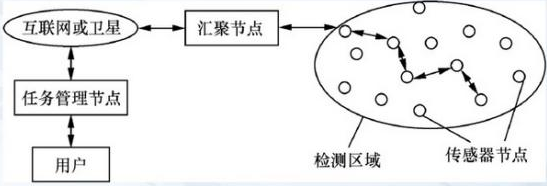

**无线传感网的主要特点**

随着社会和现代技术发展，物联网超然而至，得到了很多国家和人民的关注。物联网是基于现有的互联网发展起来的，它除了融合网络、RFID技术、信息技术之外，还引入了无线传感器技术，使得M2M型物联网有了更深的发展，而且无线传感器技术结合了嵌入式系统技术、传感器技术、现代网络以及无线通信技术，所以它本身也是一个热点的研究领域。

今天我们就来了解下无线传感器网络。

无线传感器网络（WSN）是一种分布式传感网络，它的末梢是可以感知和检查外部世界的传感器。WSN中的传感器通过无线方式通信，因此网络设置灵活，设备位置可随时更改，还可跟互联网进行有线或无线方式的连接。通过无线通信方式形成的一个多跳自组织的网络。

1、无线传感器网络结构与特点

1)WSN的网络结构

无线传感器网络系统通常包括传感器节点（Sensor node）、汇聚节点（Sink
node）和管理节点。

{width="3.7618055555555556in"
height="1.2930555555555556in"}

大量传感器节点随机部署在监测区域内部或附近，能够通过自组织方式构成网络。传感器节点检测的数据沿着其他传感器节点逐条地进行传输，在传输过程中检测数据可能被多个节点处理，经过多跳后路由到汇聚节点，最后通过互联网或卫星到达管理节点。用户通过管理节点对传感器网络进行配置和管理，发布监测数据。

1.传感器网络

处理能力、存储能力和通信能力较弱，通过小容量电池供电。从网络功能上看，每个传感器节点除了进行本地信息收集和数据处理外，还要对其他节点转发来的数据进行存储、管理和融合，并与其他节点协作完成一些特定任务。

2.汇聚节点

汇聚节点的处理能力、存储能力和通信能力相对较强，它是连接传感器网络与Internet外部网络的网关，实现两种协议间的转换，同时向传感器节点发布来自管理节点的监测任务，并把WSN收集到的数据转发到外部网络上。

3.管理节点

管理节点用于动态地管理整个无线传感器网络。传感器网络的所有者通过管理节点访问无线传感器网络的资源。

2)无线传感器网络主要特点

1.大规模

为了获取精确信息，在监测区域通常部署大量传感器节点，可能达到成千上万，甚至更多。传感器网络的大规模性包括两方面的含义：一方面是传感器节点分布在很大的地理区域内，如在原始大森林采用传感器网络进行森林防火和环境监测，需要部署大量的传感器节点；另一方面，传感器节点部署很密集，在面积较小的空间内，密集部署了大量的传感器节点。

传感器网络的大规模性具有如下优点：通过不同空间视角获得的信息具有更大的信噪比；通过分布式处理大量的采集信息能够提高监测的精确度，降低对单个节点传感器的精度要求；大量冗余节点的存在，使得系统具有很强的容错性能；大量节点能够增大覆盖的监测区域，减少洞穴或者盲区。

2.自组织

在传感器网络应用中，通常情况下传感器节点被放置在没有基础结构的地方，传感器节点的位置不能预先精确设定，节点之间的相互邻居关系预先也不知道，如通过飞机播撒大量传感器节点到面积广阔的原始森林中，或随意放置到人不可到达或危险的区域。这样就要求传感器节点具有自组织的能力，能够自动进行配置和管理，通过拓扑控制机制和网络协议自动形成转发监测数据的多跳无线网络系统。

在传感器网络使用过程中，部分传感器节点由于能量耗尽或环境因素造成失效，也有一些节点为了弥补失效节点、增加监测精度而补充到网络中，这样在传感器网络中的节点个数就动态地增加或减少，从而使网络的拓扑结构随之动态地变化。传感器网络的自组织性要能够适应这种网络拓扑结构的动态变化。

3.动态性

传感器网络的拓扑结构可能因为下列因素而改变：①环境因素或电能耗尽造成的传感器节点故障或失效；②环境条件变化可能造成无线通信链路带宽变化，甚至时断时通；③传感器网络的传感器、感知对象和观察者这三要素都可能具有移动性；④新节点的加入。这就要求传感器网络系统要能够适应这种变化，具有动态的系统可重构性。

4.可靠性

WSN特别适合部署在恶劣环境或人类不宜到达的区域，节点可能工作在露天环境中，遭受日晒、风吹、雨淋，甚至遭到人或动物的破坏。传感器节点往往采用随机部署，如通过飞机撒播或发射炮弹到指定区域进行部署。这些都要求传感器节点非常坚固，不易损坏，适应各种恶劣环境条件。

由于监测区域环境的限制以及传感器节点数目巨大，不可能人工"照顾"每个传感器节点，网络的维护十分困难甚至不可维护。传感器网络的通信保密性和安全性也十分重要，要防止监测数据被盗取和获取伪造的监测信息。因此，传感器网络的软硬件必须具有鲁棒性和容错性。

5.以数据为中心

互联网是先有计算机终端系统，然后再互联成为网络，终端系统可以脱离网络独立存在。在互联网中，网络设备用网络中惟一的IP地址标识，资源定位和信息传输依赖于终端、路由器、服务器等网络设备的IP地址。如果想访问互联网中的资源，首先要知道存放资源的服务器IP地址。可以说现有的互联网是一个以地址为中心的网络。

传感器网络是任务型的网络，脱离传感器网络谈论传感器节点没有任何意义。传感器网络中的节点采用节点编号标识，节点编号是否需要全网惟一取决于网络通信协议的设计。由于传感器节点随机部署，构成的传感器网络与节点编号之间的关系是完全动态的，表现为节点编号与节点位置没有必然联系。用户使用传感器网络查询事件时，直接将所关心的事件通告给网络，而不是通告给某个确定编号的节点。网络在获得指定事件的信息后汇报给用户。这种以数据本身作为查询或传输线索的思想更接近于自然语言交流的习惯。所以通常说传感器网络是一个以数据为中心的网络。

例如，在应用于目标跟踪的传感器网络中，跟踪目标可能出现在任何地方，对目标感兴趣的用户只关心目标出现的位置和时间，并不关心哪个节点监测到目标。事实上，在目标移动的过程中，必然是由不同的节点提供目标的位置消息。

3)无线传感器网络安全问题

1.安全路由

通常，在无线传感器网络中，大量的传感器节点密集分布在一个区域内，消息可能需要经过若干节点才能到达目的地，而且传感器网络具有动态性和多跳结构，要求每个节点都应具备路由功能。由于每个节点都是潜在的路由节点，因此更易受到攻击，使网络不安全。网络层路由协议认为整个无线传感器网络提供了关键的路由服务，安全的路由算法会直接影响无线传感器的安全性和可用性。安全路由协议一般采用链路层加密和认证、多路径路由、身份认真、双向连接认证和认证广播等机制，有效提高网络抵御外部攻击的能力，增强路由的安全性。

2.安全协议

在安全保障方面主要有密匙管理和安全组播两种方式。

密匙管理：无线传感器网络有诸多限制，例如节点能力限制，使其只能使用对称密匙和技术；电源能力限制，应使其在无线传感器网络中尽量减少通信，因为通信的耗电将大于计算的耗电；传感器网络还应考虑汇聚等减少数据冗余的问题。在部署节点钱，将密匙先配置在节点中，通常，预配置的密匙方案通过预存的秘密信息计算会话密匙，由于节点存储和能量的限制，预配置密匙管理方案必须节省存储空间和减少通信开销。

安全传播：无线传感器网络可能设置在敌对环境中，为了防止供给者向网络注入伪造信息，需要在无线传感器网络中实现基于源端认证的安全组播。
